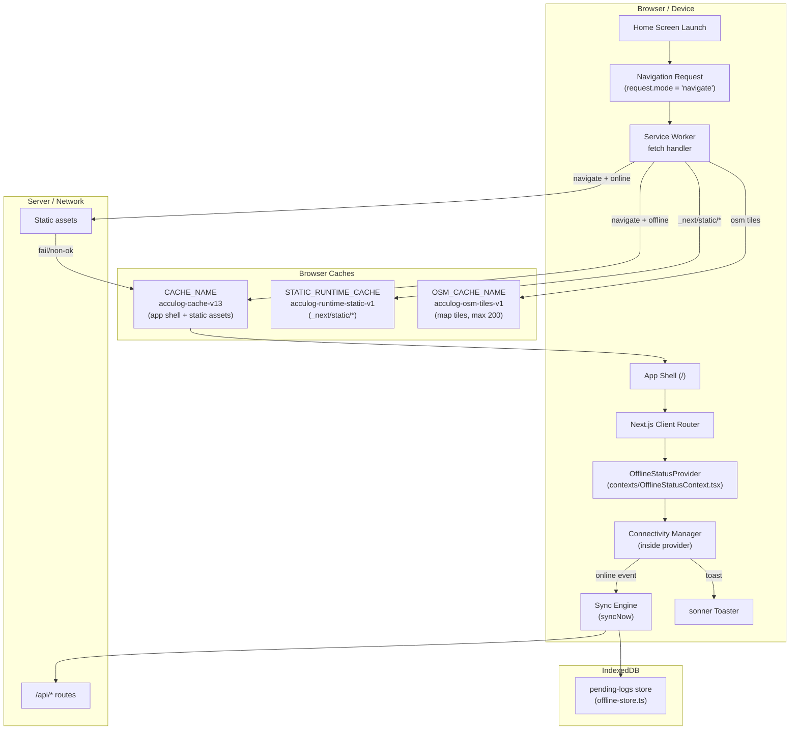
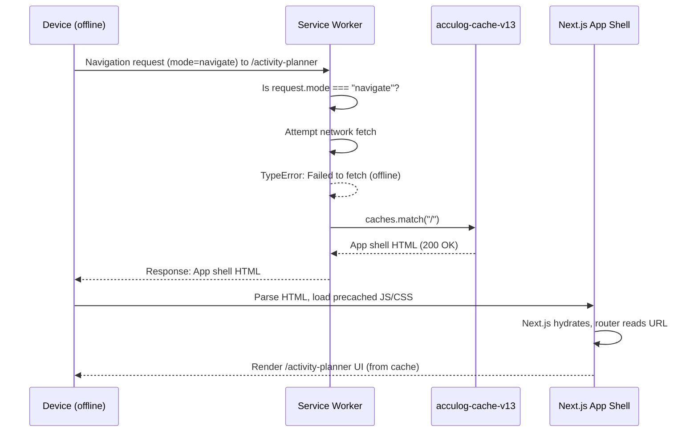
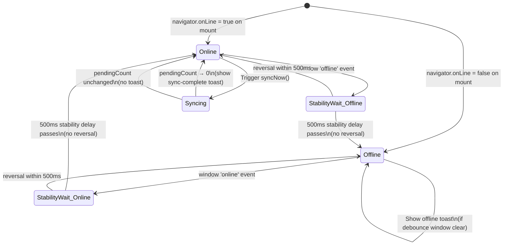

# Design Document: PWA Offline Launch Fix

## Overview

The Biolog PWA (Next.js 16) suffers from two production-blocking gaps: the installed PWA displays the browser's native offline error page on launch because the service worker has no navigation-request fallback, and the `OfflineBanner` component occupies a persistent fixed top-bar rather than using transient toast notifications. This document covers the full technical design — system architecture, component interfaces, algorithms, and formal specifications — for resolving both gaps and hardening the app-shell caching strategy, SPA routing, connectivity management, and offline UX.

The fix scope targets three files: `public/service-worker.js`, `contexts/OfflineStatusContext.tsx`, and `components/OfflineBanner.tsx` (deprecated from provider). All existing passing tests, `lib/offline-store.ts`, `lib/offline-auth.ts`, `hooks/useOfflineSync.ts`, and `public/manifest.json` are frozen.


---

## Architecture

### System Overview




### Offline PWA Launch Sequence



### Connectivity State Machine




---

## Components and Interfaces

### Component 1: Service Worker (`public/service-worker.js`)

**Purpose**: Intercept all network requests, serve the app shell for navigation requests when offline, apply appropriate caching strategies per resource type, and perform background sync.

**Interface** (constants and handler contracts):

```typescript
// Cache identifiers — increment CACHE_NAME version on each SW update
const CACHE_NAME: string             // "acculog-cache-v13"
const OSM_CACHE_NAME: string         // "acculog-osm-tiles-v1"
const STATIC_RUNTIME_CACHE: string   // "acculog-runtime-static-v1"
const SYNC_TAG: string               // "sync-activity-logs"
const OSM_MAX_ENTRIES: number        // 200

// Precache list — all entries must be cached during install
const STATIC_ASSETS: string[]        // ["/", "/Login", "/activity-planner", ...]

// Event handlers (Service Worker global scope)
self.addEventListener("install", (event: ExtendableEvent) => void)
self.addEventListener("activate", (event: ExtendableEvent) => void)
self.addEventListener("fetch", (event: FetchEvent) => void)
self.addEventListener("sync", (event: SyncEvent) => void)
```

**Responsibilities**:
- On install: precache all `STATIC_ASSETS` using `{ cache: "reload" }`, register Background Sync tag, call `self.skipWaiting()`
- On activate: delete all caches not matching current version names, call `self.clients.claim()`
- On fetch (navigate): network-first with app shell fallback
- On fetch (`/_next/static/`): stale-while-revalidate
- On fetch (OSM tiles): cache-first bounded to `OSM_MAX_ENTRIES`
- On fetch (everything else): cache-first with network fallback
- On sync: post message `SW_SYNC_TRIGGER` to all clients

---

### Component 2: OfflineStatusProvider (`contexts/OfflineStatusContext.tsx`)

**Purpose**: Single source of truth for online/offline state, connectivity notifications (toast), and the sync engine. Replaces `<OfflineBanner>` as the notification layer.

**Interface**:

```typescript
export interface OfflineStatusContextValue {
  isOnline: boolean
  isSyncing: boolean
  pendingCount: number
  lastSyncedAt: number | null
  syncNow: () => Promise<void>
}

export const OfflineStatusContext: React.Context<OfflineStatusContextValue>

export function OfflineStatusProvider(props: {
  children: React.ReactNode
}): JSX.Element

export function useOfflineStatus(): OfflineStatusContextValue
```

**Responsibilities**:
- Attach exactly one `window` `online` listener and one `offline` listener
- Apply 500 ms stability delay before committing connectivity state changes
- Debounce connectivity toast notifications within a 5-second window
- Show offline toast: "You're offline. Changes will be saved locally and synced automatically." (auto-dismiss 4 s)
- Show reconnect toast: "You're back online. Syncing pending changes..." (auto-dismiss 3 s)
- Show sync-complete toast: "All offline changes have been synced." (auto-dismiss 3 s)
- Trigger `syncNow()` on each reconnect event
- NOT render `<OfflineBanner>` — all notifications via `sonner` toast

---

### Component 3: OfflineBanner (`components/OfflineBanner.tsx`)

**Purpose**: Retained as an inert, props-driven display component for backward compatibility with existing tests. No longer auto-mounted by any provider.

**Interface** (unchanged):

```typescript
interface Props {
  isOnline: boolean
  isSyncing: boolean
  pendingCount: number
  onSyncNow?: () => void
}

export default function OfflineBanner(props: Props): JSX.Element | null
```

**Responsibilities**:
- Render the fixed-position banner when called explicitly with props
- Never self-mount — no provider or layout imports it automatically after this fix


---

## Data Models

### Connectivity State

```typescript
interface ConnectivityState {
  isOnline: boolean            // committed (post-stability-delay) online status
  pendingStabilityTimer: ReturnType<typeof setTimeout> | null  // active delay timer
  lastOfflineToastAt: number | null  // epoch-ms of last offline toast shown
  lastOnlineToastAt: number | null   // epoch-ms of last online toast shown
  lastSyncCompleteToastAt: number | null  // epoch-ms of last sync-complete toast
}

// Constants
const STABILITY_DELAY_MS = 500    // ms before committing connectivity state
const DEBOUNCE_WINDOW_MS = 5000   // ms guard between duplicate toasts
```

**Validation Rules**:
- `isOnline` is always a boolean, never null/undefined
- Stability timer is cancelled and replaced on each new connectivity event within the window
- Toast debounce timestamps are updated only when a toast is actually shown, not on every event

### Service Worker Cache Manifest

```typescript
interface CacheManifest {
  CACHE_NAME: string               // versioned app shell cache
  OSM_CACHE_NAME: string           // OSM tile cache (LRU bounded)
  STATIC_RUNTIME_CACHE: string     // runtime cache for _next/static/*
  STATIC_ASSETS: string[]          // must-precache URLs
  OSM_MAX_ENTRIES: number          // LRU eviction threshold for OSM tiles
}

// Current values
const manifest: CacheManifest = {
  CACHE_NAME: "acculog-cache-v13",
  OSM_CACHE_NAME: "acculog-osm-tiles-v1",
  STATIC_RUNTIME_CACHE: "acculog-runtime-static-v1",
  STATIC_ASSETS: [
    "/",
    "/Login",
    "/activity-planner",
    "/manifest.json",
    "/icon-192.png",
    "/icon-512.png",
    "/models/tiny_face_detector/tiny_face_detector_model.json",
    "/models/face_landmark68/face_landmark_68_model.json",
  ],
  OSM_MAX_ENTRIES: 200,
}
```


---

## Algorithmic Pseudocode

### SW fetch handler — Navigation Fallback

**Preconditions:**
- `event.request` is a valid `Request` object
- `CACHE_NAME` cache is open and contains `"/"` (after install)

**Postconditions:**
- If `request.mode === "navigate"`: returns a `Response` with the app shell or a network response — never propagates a network error to the browser
- If request is for `/_next/static/*`: returns SWR response
- If request is for OSM tiles: returns cache-first bounded response
- Otherwise: returns cache-first with network fallback

**Loop Invariants:** N/A (single fetch per event, no loops)

```typescript
self.addEventListener("fetch", (event: FetchEvent) => {
  const { request } = event
  const url = new URL(request.url)

  // Exclude dev-only HMR and Next.js internals
  if (isDevOnlyRequest(url)) return

  if (request.mode === "navigate") {
    // Navigation fallback: network-first, then cached app shell
    event.respondWith(handleNavigationRequest(request))
    return
  }

  if (isStaticAsset(url)) {
    event.respondWith(handleStaticAsset(request))
    return
  }

  if (isNextJsStatic(url)) {
    event.respondWith(handleStaleWhileRevalidate(request))
    return
  }

  if (isOSMTile(url)) {
    event.respondWith(handleOSMTile(request))
    return
  }

  // Default: cache-first with network fallback
  event.respondWith(
    caches.match(request).then(cached => cached ?? fetch(request))
  )
})
```

```typescript
async function handleNavigationRequest(request: Request): Promise<Response> {
  // PRECONDITION: request.mode === "navigate"
  try {
    const networkResponse = await fetch(request)
    if (networkResponse.ok) return networkResponse
    // Non-OK response (e.g. 503) — fall through to cache
    throw new Error(`Non-OK: ${networkResponse.status}`)
  } catch {
    // Network unavailable or non-OK — serve cached app shell
    const cache = await caches.open(CACHE_NAME)
    const cached = await cache.match("/")
    if (cached) return cached
    // Last resort: let the original request propagate
    return fetch(request)
  }
  // POSTCONDITION: always returns a Response, never throws
}
```

---

### SW install handler — Precaching

**Preconditions:** Service worker just installed; network available (install only runs online)

**Postconditions:**
- All `STATIC_ASSETS` stored in `CACHE_NAME` with `{ cache: "reload" }`
- Background Sync tag registered
- `self.skipWaiting()` called — new SW activates immediately

```typescript
self.addEventListener("install", (event: ExtendableEvent) => {
  event.waitUntil(
    (async () => {
      const cache = await caches.open(CACHE_NAME)
      await cache.addAll(
        STATIC_ASSETS.map(url => new Request(url, { cache: "reload" }))
      )
      if ("sync" in self.registration) {
        await (self.registration as any).sync.register(SYNC_TAG)
      }
      await self.skipWaiting()
    })()
  )
})
```

---

### SW activate handler — Cache Cleanup

**Preconditions:** New service worker activating

**Postconditions:**
- All caches whose keys are not in `{ CACHE_NAME, OSM_CACHE_NAME, STATIC_RUNTIME_CACHE }` are deleted
- `self.clients.claim()` called — all open tabs immediately controlled

```typescript
self.addEventListener("activate", (event: ExtendableEvent) => {
  event.waitUntil(
    (async () => {
      const validCaches = new Set([CACHE_NAME, OSM_CACHE_NAME, STATIC_RUNTIME_CACHE])
      const keys = await caches.keys()
      await Promise.all(
        keys.filter(k => !validCaches.has(k)).map(k => caches.delete(k))
      )
      await self.clients.claim()
    })()
  )
})
```


### SW SWR handler — `/_next/static/*`

**Preconditions:** URL pathname starts with `/_next/static/`

**Postconditions:**
- Cached response returned immediately (if exists)
- Background revalidation from network updates the cache
- Network-only response returned if no cache entry exists

```typescript
async function handleStaleWhileRevalidate(request: Request): Promise<Response> {
  const cached = await caches.match(request)

  const networkUpdate = fetch(request).then(async response => {
    if (response.ok) {
      const cache = await caches.open(STATIC_RUNTIME_CACHE)
      await cache.put(request, response.clone())
    }
    return response
  }).catch(() => cached)  // suppress background errors

  return cached ?? networkUpdate
}
```

---

### SW OSM tile handler — LRU cache-first, bounded to 200 entries

**Preconditions:** URL hostname is `tile.openstreetmap.org`

**Postconditions:**
- Cached tile returned immediately if present
- Network tile fetched, stored, and returned if not cached
- If cache size exceeds `OSM_MAX_ENTRIES`, oldest entry is evicted (LRU approximation via insertion order)

```typescript
async function handleOSMTile(request: Request): Promise<Response> {
  const cache = await caches.open(OSM_CACHE_NAME)
  const cached = await cache.match(request)
  if (cached) return cached

  const response = await fetch(request)
  if (response.ok) {
    // LRU eviction: delete oldest entry if at limit
    const keys = await cache.keys()
    if (keys.length >= OSM_MAX_ENTRIES) {
      await cache.delete(keys[0])  // oldest entry (insertion-ordered)
    }
    await cache.put(request, response.clone())
  }
  return response
}
```


### Connectivity Manager — Stability Delay + Debounce

**Preconditions:**
- `OfflineStatusProvider` is mounted in `app/layout.tsx`
- `sonner` `toast` is available (Toaster mounted in layout)

**Postconditions:**
- At most one `online` or `offline` listener attached to `window`
- Connectivity state committed only after 500 ms of stability
- No duplicate toasts within `DEBOUNCE_WINDOW_MS` (5000 ms)
- All context consumers receive updated `isOnline` synchronously via React state

**Loop Invariants:** N/A (event-driven, no loops in the manager itself)

```typescript
// Inside OfflineStatusProvider useEffect

const STABILITY_DELAY_MS = 500
const DEBOUNCE_WINDOW_MS = 5000

const stabilityTimerRef = useRef<ReturnType<typeof setTimeout> | null>(null)
const lastOfflineToastRef = useRef<number | null>(null)
const lastOnlineToastRef = useRef<number | null>(null)

function handleConnectivityChange(goingOnline: boolean): void {
  // PRECONDITION: goingOnline is a boolean

  // Cancel any pending stability timer for the opposite direction
  if (stabilityTimerRef.current !== null) {
    clearTimeout(stabilityTimerRef.current)
  }

  stabilityTimerRef.current = setTimeout(() => {
    // STABILITY: 500ms passed without reversal — commit state
    stabilityTimerRef.current = null
    const now = Date.now()

    if (goingOnline) {
      setIsOnline(true)
      const lastShown = lastOnlineToastRef.current
      if (lastShown === null || now - lastShown >= DEBOUNCE_WINDOW_MS) {
        toast("You're back online. Syncing pending changes...", { duration: 3000 })
        lastOnlineToastRef.current = now
      }
      syncNow()
    } else {
      setIsOnline(false)
      const lastShown = lastOfflineToastRef.current
      if (lastShown === null || now - lastShown >= DEBOUNCE_WINDOW_MS) {
        toast("You're offline. Changes will be saved locally and synced automatically.", {
          duration: 4000,
        })
        lastOfflineToastRef.current = now
      }
    }
    // POSTCONDITION: isOnline updated, toast shown (if debounce clear), syncNow triggered (if online)
  }, STABILITY_DELAY_MS)
}

window.addEventListener("online", () => handleConnectivityChange(true))
window.addEventListener("offline", () => handleConnectivityChange(false))
```

---

### Sync-Complete Toast Trigger

**Preconditions:** `pendingCount` transitions from `> 0` to `0` while `isOnline === true`

**Postconditions:**
- Sync-complete toast shown: "All offline changes have been synced." (auto-dismiss 3 s)
- No duplicate toast within `DEBOUNCE_WINDOW_MS`

```typescript
const lastSyncCompleteToastRef = useRef<number | null>(null)
const prevPendingCountRef = useRef<number>(0)

useEffect(() => {
  const now = Date.now()
  const prevCount = prevPendingCountRef.current

  if (prevCount > 0 && pendingCount === 0 && isOnline) {
    const lastShown = lastSyncCompleteToastRef.current
    if (lastShown === null || now - lastShown >= DEBOUNCE_WINDOW_MS) {
      toast("All offline changes have been synced.", { duration: 3000 })
      lastSyncCompleteToastRef.current = now
    }
  }

  prevPendingCountRef.current = pendingCount
}, [pendingCount, isOnline])
```


---

## Key Functions with Formal Specifications

### `handleNavigationRequest(request)`

```typescript
async function handleNavigationRequest(request: Request): Promise<Response>
```

**Preconditions:**
- `request.mode === "navigate"`
- `request.url` is a same-origin URL

**Postconditions:**
- Returns a `Response` with `status === 200` in all cases
- If network fetch succeeds with `ok === true`: returns network response directly
- If network fetch fails or returns non-OK: returns `await caches.open(CACHE_NAME).match("/")`
- If cache also misses: falls back to `fetch(request)` (allows browser default error)
- Never throws; never returns a `TypeError` to the browser's navigation stack

**Loop Invariants:** N/A

---

### `handleConnectivityChange(goingOnline)`

```typescript
function handleConnectivityChange(goingOnline: boolean): void
```

**Preconditions:**
- Called from a `window` `online` or `offline` event handler
- `STABILITY_DELAY_MS = 500`, `DEBOUNCE_WINDOW_MS = 5000` are constants

**Postconditions:**
- Clears any outstanding stability timer
- Schedules a new stability timer for `STABILITY_DELAY_MS` ms
- When timer fires without cancellation: commits `isOnline = goingOnline` via `setIsOnline`
- When timer fires and debounce window is clear: shows appropriate toast; records timestamp
- When timer fires and `goingOnline === true`: calls `syncNow()`
- When two events fire within `STABILITY_DELAY_MS`: only the last one's timer fires

**Loop Invariants:** N/A (single timer per call)

---

### `syncNow()`

```typescript
const syncNow: () => Promise<void>
```

**Preconditions:**
- Called while `navigator.onLine === true` (guarded at call site)
- `syncingRef.current === false` (re-entrant guard prevents overlap)

**Postconditions:**
- Processes all `pending-logs` entries in order
- Each entry with `retries >= 5` is counted as dead-letter and skipped
- Each entry with `retries < 5` is POSTed to `/api/activity-logs`
  - On `response.ok`: entry removed, `pendingCount` decremented
  - On 4xx: entry incremented; if `retries + 1 >= 5`, treated as dead-letter
  - On 5xx or network error: entry retried with exponential backoff (base 1s, ×2, cap 32s)
- `setLastSyncedAt(Date.now())` called after processing all entries
- `isSyncing` is `true` during processing, `false` on exit
- `syncLock` released in `finally` block — no lock leak on error

**Loop Invariants:**
- For each iteration: `syncingRef.current === true` throughout
- All previously processed entries have been removed from or incremented in the store
- `pendingCount` reflects the number of remaining unprocessed entries

---

### `isDevOnlyRequest(url)`

```typescript
function isDevOnlyRequest(url: URL): boolean
```

**Preconditions:** `url` is a valid `URL` object

**Postconditions:**
- Returns `true` if pathname matches any of: `/_next/webpack-hmr`, `/_next/static/development`, `/__nextjs`, `/_next/data`, or if `url.search` includes `hot-update`
- Returns `false` otherwise
- No side effects


---

## Example Usage

### Service Worker — Offline Navigation

```typescript
// SW fetch event fires when user launches PWA from home screen (offline)
// request.mode === "navigate", navigator.onLine === false

const response = await handleNavigationRequest(new Request("/activity-planner", {
  mode: "navigate",
  headers: { Accept: "text/html" },
}))
// response.status === 200
// response body === cached index.html (app shell)
// Next.js boots from cache, renders /activity-planner route
```

### Service Worker — Deep Link Refresh (Offline)

```typescript
// User refreshes /admin/attendance-summary while offline
// request.mode === "navigate", not an API route

const response = await handleNavigationRequest(new Request("/admin/attendance-summary", {
  mode: "navigate",
}))
// Returns cached "/", Next.js router reads window.location.pathname
// and renders /admin/attendance-summary from client-side code
```

### OfflineStatusProvider — Toast Flow

```typescript
// Device goes offline while user is on /dashboard
window.dispatchEvent(new Event("offline"))
// → 500ms stability delay starts
// → (no reversal within 500ms)
// → setIsOnline(false)
// → toast("You're offline. Changes will be saved locally and synced automatically.", { duration: 4000 })

// User creates an activity log offline → queued to IndexedDB
// pendingCount updates to 1

// Device comes back online
window.dispatchEvent(new Event("online"))
// → 500ms stability delay starts
// → setIsOnline(true)
// → toast("You're back online. Syncing pending changes...", { duration: 3000 })
// → syncNow() triggered

// Sync completes, pendingCount transitions 1 → 0
// → toast("All offline changes have been synced.", { duration: 3000 })
```

### OfflineStatusProvider — Rapid Flapping (Suppressed)

```typescript
// Unstable network: online → offline → online within 300ms
window.dispatchEvent(new Event("offline"))  // starts 500ms timer
// 200ms later:
window.dispatchEvent(new Event("online"))   // cancels offline timer, starts new 500ms timer
// 500ms later: timer fires
// → setIsOnline(true), online toast shown (if debounce clear)
// → The intermediate "offline" state is NEVER committed
```


---

## Correctness Properties

### Property 1 — Navigation Fallback Never Shows Browser Offline Page

For all navigation requests `req` where `req.mode === "navigate"` and `CACHE_NAME` contains an entry for `"/"`:

```
∀ req: Request where req.mode = "navigate"
  ∧ cache.has(CACHE_NAME, "/")
  ⟹ handleNavigationRequest(req).status = 200
  ∧ typeof handleNavigationRequest(req).body = "string"
```

No navigation request returns a `TypeError` or network error to the browser. Validates: Requirements 1.1, 1.2, 1.5.

---

### Property 2 — All STATIC_ASSETS Precached After Install

```
∀ url ∈ STATIC_ASSETS, after install event completes:
  caches.match(url, { cacheName: CACHE_NAME }) ≠ null
```

Every entry in `STATIC_ASSETS` is retrievable from `CACHE_NAME` after a successful install. Validates: Requirements 2.8, 4.1, 4.2.

---

### Property 3 — SPA Routing: All Same-Origin Non-API Navigation Returns App Shell

```
∀ req: Request where req.mode = "navigate"
  ∧ origin(req.url) = self.location.origin
  ∧ ¬req.url.pathname.startsWith("/api/")
  ∧ ¬req.url.pathname.startsWith("/_next/")
  ⟹ body(handleNavigationRequest(req)) = body(caches.match("/"))
```

Deep links and refreshes on any app route always return the app shell, enabling client-side routing. Validates: Requirements 3.1, 3.2, 3.3, 3.4.

---

### Property 4 — API Routes Are NOT Intercepted by Navigation Fallback

```
∀ req: Request where req.url.pathname.startsWith("/api/")
  ⟹ navigationFallback does NOT apply
  ∧ fetch(req) propagates to network normally
```

The navigation fallback handler checks for `/api/` prefix and excludes it. Validates: Requirement 3.2.

---

### Property 5 — Stability Delay Suppresses Flapping

```
∀ sequence of events E₁, E₂ where:
  E₁.type = "offline", E₂.type = "online"
  ∧ time(E₂) - time(E₁) < STABILITY_DELAY_MS
⟹ isOnline after sequence = true
∧ no "offline" toast shown
```

Rapid online/offline transitions within 500 ms do not commit the intermediate state. Validates: Requirement 5.2.

---

### Property 6 — Debounce Prevents Duplicate Toasts

```
∀ two offline events e₁, e₂ where time(e₂) - time(e₁) < DEBOUNCE_WINDOW_MS
  ∧ both events survive the stability delay
⟹ exactly one offline toast shown (for e₁), none for e₂
```

The debounce guard prevents toast spam during repeated connectivity changes. Validates: Requirements 5.3, 5.4, 6.3.

---

### Property 7 — Single Source of Truth

```
∀ consumer C of OfflineStatusContext:
  C.isOnline = OfflineStatusProvider.isOnline
  ∧ no consumer has its own window.addEventListener("online"/"offline")
  ∧ count(window.addEventListener("online")) = 1
  ∧ count(window.addEventListener("offline")) = 1
```

Connectivity state is managed in exactly one place. Validates: Requirement 5.1.

---

### Property 8 — Old Caches Cleaned Up on Activate

```
∀ cacheKey k in caches.keys() after activate:
  k ∈ { CACHE_NAME, OSM_CACHE_NAME, STATIC_RUNTIME_CACHE }
```

No stale-version caches persist after a service worker update. Validates: Requirements 2.7, 2.9.


---

## Error Handling

### Scenario 1: App Shell Not in Cache on Navigation Request

**Condition**: Navigation request arrives but `"/"` is not in `CACHE_NAME` (e.g., first visit without prior online session, cache corruption).

**Response**: `handleNavigationRequest` falls through to `fetch(request)` after the cache miss, allowing the browser to attempt a network fetch. If network is also unavailable, the browser shows its default offline page — this is the correct degraded behavior for a device that has never installed the PWA online.

**Recovery**: Once the device is online, the next visit precaches all assets and the next offline launch succeeds.

---

### Scenario 2: Network Flapping During Stability Window

**Condition**: `online` and `offline` events fire in rapid succession (< 500 ms apart) due to an unstable connection.

**Response**: Each new event cancels the previous stability timer. Only the final state after 500 ms of stability is committed. No toast is shown for transient intermediate states.

**Recovery**: Automatic — the stability timer fires and commits the final stable state.

---

### Scenario 3: Duplicate Toast from Repeated Connectivity Events

**Condition**: Two `offline` events with stability delays both complete within `DEBOUNCE_WINDOW_MS` (5 s).

**Response**: The second event's toast is suppressed by the debounce check (`now - lastOfflineToastRef.current < 5000`). The `isOnline` state is still updated correctly.

**Recovery**: After `DEBOUNCE_WINDOW_MS` passes, the next connectivity change triggers a toast normally.

---

### Scenario 4: Sync Fails for Individual Log Entry

**Condition**: A network request to `/api/activity-logs` fails or returns 5xx during `syncNow`.

**Response**: `incrementRetry(log.id)` is called. The entry remains in `pending-logs` and will be retried with exponential backoff (base 1s × 2^retries, capped at 32s, max 5 attempts).

**Recovery**: On the next reconnect or manual `syncNow()` call, the entry is retried. After 5 failures against a 4xx response, it moves to dead-letter and is excluded from future syncs.

---

### Scenario 5: OSM Tile Cache at Capacity

**Condition**: OSM tile cache reaches `OSM_MAX_ENTRIES` (200 entries).

**Response**: The oldest entry (cache insertion order) is evicted before storing the new tile. This is an LRU approximation.

**Recovery**: Automatic — evicted tiles are re-fetched on next map interaction when online.

---

### Scenario 6: Service Worker Update Available

**Condition**: A new `service-worker.js` is deployed with an incremented `CACHE_NAME`.

**Response**: The new SW installs immediately (`skipWaiting()`), activates immediately (`clients.claim()`), precaches assets under the new cache name, and deletes all caches not matching the current version names.

**Recovery**: Users get the updated SW on their next page load, including fresh precached assets. Old caches are cleaned up without any user action.


---

## Testing Strategy

### Unit Testing Approach

All unit tests are co-located in `__tests__/` following the existing pattern in the project.

**Service Worker tests** (`__tests__/service-worker.test.ts`):
- Navigation request while offline returns cached app shell (status 200)
- Navigation request to `/api/anything` is NOT intercepted by navigation fallback
- Navigation request while online returns network response
- Navigation request while online (network fails) returns cached app shell
- Install event precaches all STATIC_ASSETS entries
- Activate event deletes all caches not in the current valid set
- `_next/static/` requests use SWR (immediate cache response + background update)
- OSM tile requests are bounded to `OSM_MAX_ENTRIES` (evicts oldest on overflow)
- `isDevOnlyRequest` returns true for HMR/webpack-hmr/hot-update patterns

**OfflineStatusProvider tests** (`__tests__/OfflineStatusContext.test.tsx`):
- Offline toast shown with correct message when `window` `offline` event fires (after stability delay)
- Online toast shown with correct message when `window` `online` event fires (after stability delay)
- Sync-complete toast shown when `pendingCount` transitions from `> 0` to `0` while online
- Debounce: second `offline` event within `DEBOUNCE_WINDOW_MS` does NOT produce a second toast
- Debounce: second `online` event within `DEBOUNCE_WINDOW_MS` does NOT produce a second toast
- Stability delay: rapid offline→online within 500ms does NOT commit offline state
- `syncNow()` called once on reconnect, not twice if already syncing
- `OfflineBanner` is NOT rendered inside `OfflineStatusProvider`
- Context exposes `{ isOnline, isSyncing, pendingCount, lastSyncedAt, syncNow }` with unchanged shape

---

### Property-Based Testing Approach

**Property Test Library**: `fast-check` (already available in the project's test environment)

**Property test** (`__tests__/connectivity-stability.property.test.ts`):

```
Property: FOR ALL sequences of online/offline events where each consecutive
pair is separated by less than STABILITY_DELAY_MS,
  the committed isOnline state after the sequence ends
  SHALL equal the state of the final event in the sequence.
```

```typescript
import fc from "fast-check"

fc.assert(
  fc.property(
    fc.array(fc.boolean(), { minLength: 1, maxLength: 20 }),
    (events) => {
      // Each event fires < STABILITY_DELAY_MS after the previous
      const finalState = simulateRapidEvents(events)
      // isOnline should equal the last event's value
      return finalState.isOnline === events[events.length - 1]
    }
  )
)
```

**Property test** — Debounce invariant:

```
FOR ALL pairs of connectivity events (e₁, e₂) of the same type
  where timeBetween(e₁, e₂) < DEBOUNCE_WINDOW_MS,
  exactly one toast of that type is shown, never two.
```

---

### Integration Testing Approach

**Offline launch sequence** (`__tests__/offline-launch.integration.test.ts`):
1. Simulate SW install event → verify all STATIC_ASSETS in cache
2. Simulate navigation request to `/activity-planner` with network disabled → verify app shell returned
3. Verify app shell document contains required `<script>` tags for Next.js hydration

**Full offline lifecycle test**:
1. Mount `OfflineStatusProvider` with `isOnline = true`, `pendingCount = 2`
2. Fire `window` `offline` → wait 500 ms → verify offline toast shown
3. Fire `window` `online` → wait 500 ms → verify online toast + `syncNow` called
4. Simulate `pendingCount → 0` → verify sync-complete toast shown
5. Verify no `OfflineBanner` rendered anywhere in the provider tree


---

## Performance Considerations

- **No startup network dependency**: The app shell and all precached assets are served from `CACHE_NAME` synchronously, with zero network round-trips during offline launch.
- **SWR for versioned assets**: `/_next/static/` files have content-hash filenames, so serving from cache is always safe; background revalidation keeps the cache warm for the next update.
- **OSM tile LRU cap**: Capping at 200 entries prevents the cache from growing unbounded on heavy map usage. Each tile is ~10 KB, so 200 tiles ≈ 2 MB.
- **Stability delay (500 ms)**: Prevents unnecessary React re-renders during network flapping. The delay is imperceptible to the user in the context of connectivity changes.
- **Sync engine debouncing**: `acquireSyncLock()` prevents concurrent sync runs, which would otherwise multiply network requests on reconnect.
- **Toast auto-dismiss**: No UI cleanup required from the user; toasts vanish in 3–4 seconds, keeping the UX unobtrusive.

---

## Security Considerations

- **No credentials in cache**: `STATIC_ASSETS` contains only public static files. Authentication tokens and session data remain in IndexedDB/localStorage controlled by existing `lib/offline-auth.ts` — no change to that layer.
- **API routes excluded from navigation fallback**: The SW never returns cached app shell HTML for `/api/*` requests, preventing API responses from being spoofed with cached HTML.
- **Cache versioning**: Incrementing `CACHE_NAME` on each deployment ensures stale or potentially compromised assets from old versions are evicted immediately upon activation.
- **`skipWaiting` + `clientsClaim`**: Ensures all tabs get the latest SW (and latest security fixes) without requiring the user to close and reopen the app.
- **Content security**: The SW only caches responses with `response.ok === true`, preventing caching of error pages or unexpected server responses.

---

## Dependencies

| Dependency | Version / Source | Purpose |
|---|---|---|
| `sonner` | Already in project (`components/ui/sonner`) | Toast notifications for connectivity events |
| `fast-check` | Dev dependency (confirm in `package.json`) | Property-based testing for stability/debounce properties |
| `next/font/google` (Inter) | Already in `app/layout.tsx` | Font — no change |
| IndexedDB (`lib/offline-store.ts`) | Existing — frozen | Pending log storage, sync engine |
| Service Worker API | Browser native | Navigation fallback, caching, background sync |
| Background Sync API | Browser native (progressive enhancement) | Retry sync when connectivity restores on supported browsers |

The manifest (`public/manifest.json`) requires **no modifications** — `start_url`, `scope`, `id`, `display`, `background_color`, `theme_color`, and all icon entries are already correctly configured.
